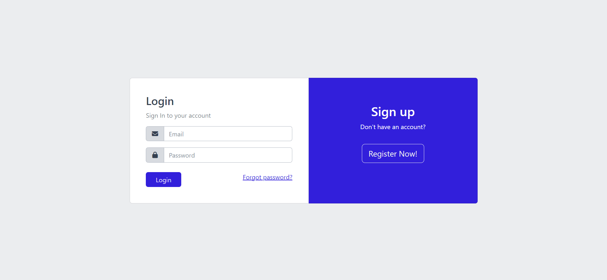
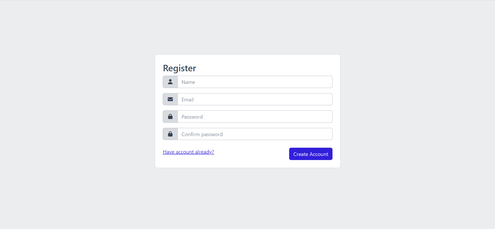
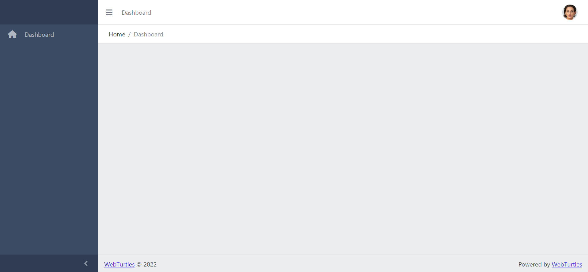

# Laravel + CoreUI + Auth boilerplate

```
composer install
```

-   Copy .env.example to .env
-   Set database configuration in .env

```
DB_DATABASE=<db-name>
php artisan migrate
```

-   Generate key

```
php artisan key:generate
```

-   https://coreui.io/docs/getting-started/introduction/
-   https://coreui.io/demos/bootstrap/4.2/free/
-   https://fontawesome.com/icons/house?s=solid&f=classic

## Screenshots




